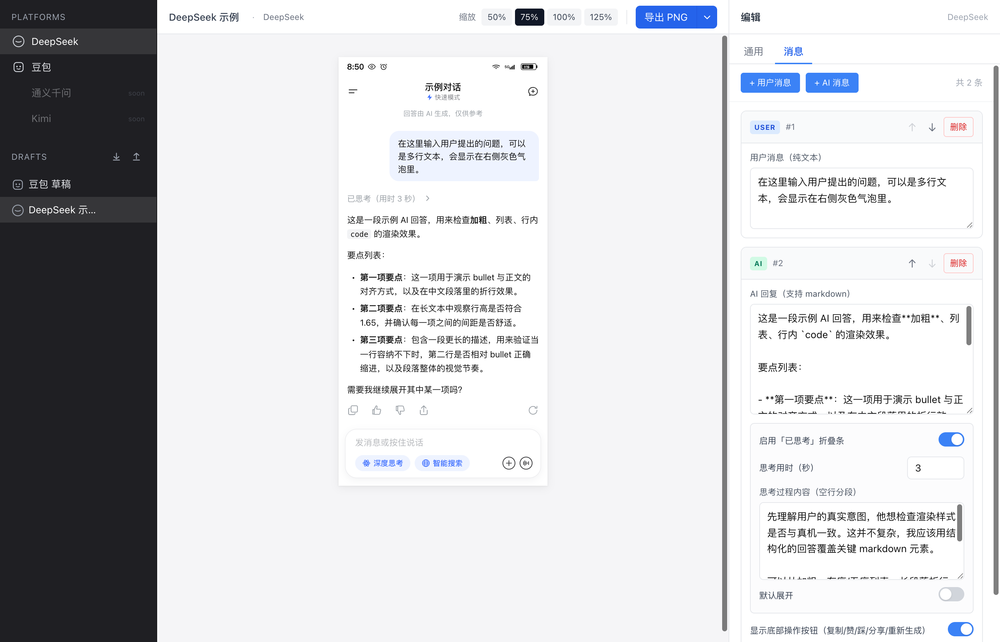
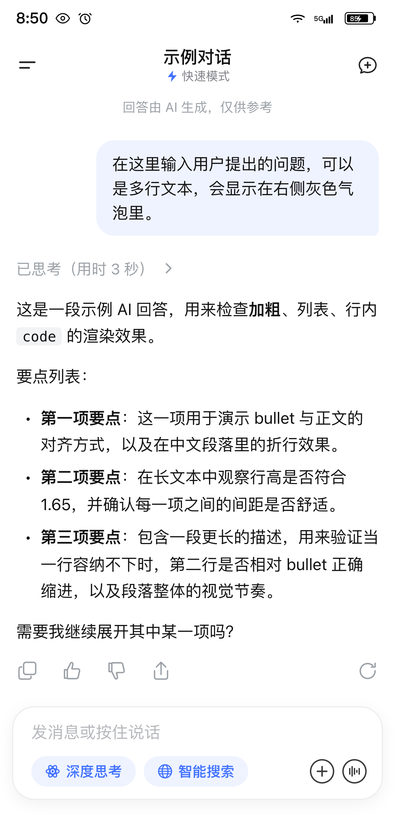
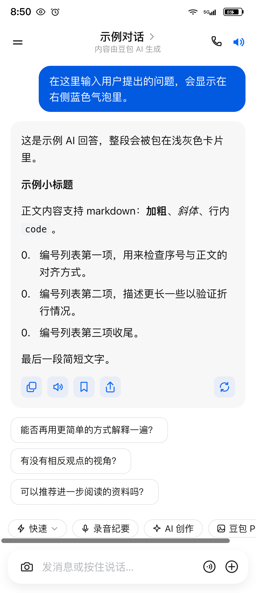

# AIChat UI Simulator

> 让心理学 / 传播学研究者快速制作高保真 AI 聊天截图的本地工具，用于在线实验的刺激材料生成。

**[简体中文](README.md)** · [English](README.en.md)



## 用途与背景

本工具诞生于一项关于「AI 回复中的情感支持 ↔ 建设性社会行为」的在线实验研究。预实验阶段，每条刺激材料需要在多个实验条件之间保持视觉一致，只允许操纵特定变量（如情感支持强度）。手工 PS 截图既费时又难以保证一致性，本工具解决：

- 在浏览器中**可视化编辑**多家主流 AI App 的对话内容
- 实时所见即所得渲染，导出**长截图**直接嵌入问卷平台
- 草稿复制 + JSON 导入导出，实现「只改一个变量」的对照工作流

完整需求与架构详见 [PRD.md](PRD.md)。

## 截图

<table>
  <tr>
    <td align="center">
      <b>DeepSeek 模板</b><br>
      
    </td>
    <td align="center">
      <b>豆包模板</b><br>
      
    </td>
  </tr>
</table>

## 已支持的模板

| 平台 | 状态 | 备注 |
|---|---|---|
| DeepSeek | ✅ Ready | 快速模式 / 专家模式 / 已思考折叠展开 |
| 豆包 (Doubao) | ✅ Ready | 快速模式 / AI 卡片 / 推荐追问 / 底部 toolbar |
| 通义千问 (Qwen) | 🔜 | 计划中 |
| Kimi | 🔜 | 计划中 |

## 技术栈

Vite · React 18 · TypeScript · Tailwind CSS · Zustand · react-markdown · html-to-image

## 快速开始

需要 Node.js 18+。

```bash
git clone https://github.com/ganze-chen/AIChat-UI-Simulator.git
cd AIChat-UI-Simulator
npm install
npm run dev
```

浏览器会自动打开 `http://localhost:5173/`。

## 使用指南

### 1. 新建草稿
左栏 **PLATFORMS** 区域点击 DeepSeek 或 豆包，会自动创建一份该平台的草稿并切换到它。

### 2. 编辑内容
右栏切换 **通用** / **消息** 两个 tab：

- **通用**：状态栏时间、对话标题、模式、菜单/+ 按钮、输入栏选项、底部 toolbar pills（豆包专有）等
- **消息**：增删 / 上下移动用户和 AI 消息，AI 消息支持完整 markdown，含「已思考」折叠条（DeepSeek）和「推荐追问」（豆包）

所有修改实时反映到中间预览区。

### 3. 缩放预览
预览顶部 **缩放** 按钮在 50% / 75% / 100% / 125% 间切换，只影响显示，不影响导出。

### 4. 导出 PNG
预览顶部 **导出 PNG** 按钮：

- 默认 3x 像素密度（适合 Retina）
- 下拉箭头：调密度（2x / 3x / 4x）、导出时隐藏输入栏、复制到剪贴板
- 文件名：`deepseek_{草稿名}_{YYYYMMDD-HHmm}.png`

### 5. 草稿管理（对照实验的关键工作流）
左栏 **DRAFTS** 区域：

- hover 单条草稿可见 ✎ 重命名、⎘ 复制副本、✕ 删除
- 标题右侧 ⤓ 全部导出为 JSON、⤒ 从 JSON 导入（支持合并 / 覆盖两种模式）

> **复制副本**是「控制变量」工作流的核心：复制一份后只改要操纵的字段（如把 AI 回复换成"低情感支持"版本），其他元素保持完全一致。

### 6. AI 消息支持的 markdown

- `**加粗**`、`*斜体*`、`` `行内代码` ``
- 标题 `#` `##` `###`
- 无序列表 `- `、有序列表 `1. `
- 代码块、引用 `>`、表格（GFM）、链接

## 项目结构

```
src/
├── App.tsx                — 三栏布局入口
├── components/            — Sidebar / PreviewArea / EditorPanel / 导出 / 草稿 IO
├── store/useStore.ts      — Zustand store + localStorage 持久化
├── templates/
│   ├── types.ts           — Template 接口定义（模板插件化）
│   ├── registry.ts        — 模板注册表
│   ├── deepseek/          — DeepSeek 模板（renderer + editor + icons）
│   └── doubao/            — 豆包模板
└── utils/
    ├── export.ts          — html-to-image 导出包装
    └── storage.ts         — 草稿 JSON 导入导出
```

新增平台 = 新建一个 `templates/<platform>/` 目录 + 在 `registry.ts` 注册。

## 路线图

- [ ] 豆包思考模式形态
- [ ] 通义千问、Kimi 模板
- [ ] DeepSeek 浅色 / 深色主题切换
- [ ] 用户头像、引用回复等可选元素

## 许可与使用约束

本工具仅用于学术研究目的。截图模仿的是各家 AI App 的公开 UI 形态，**请勿用于商业仿冒、欺诈或任何欺骗性用途**。导出图片若用于公开发表，需明确标注为「实验刺激材料」。

## 反馈

发现问题或希望支持新平台 → 欢迎在 [Issues](https://github.com/ganze-chen/AIChat-UI-Simulator/issues) 反馈。
